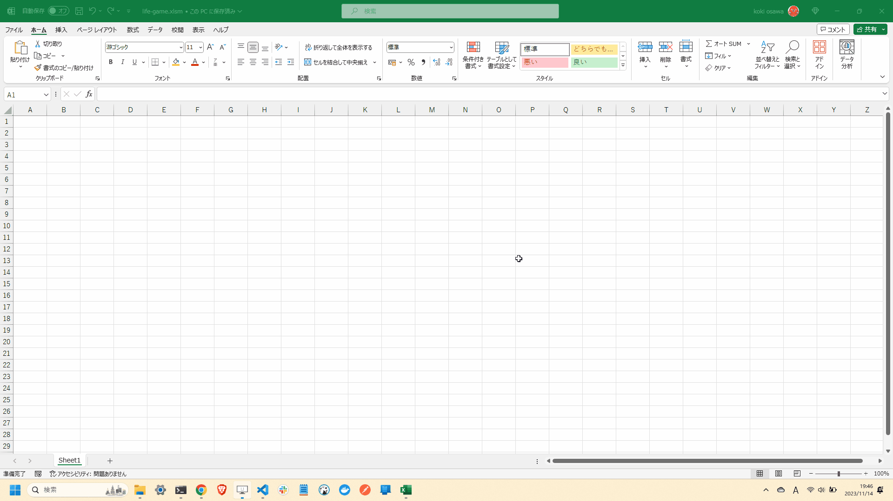

# life-game.macro

🧂🧂🧂 Excelマクロでライフゲームを実装してみる！  

  

## 準備方法

### 1. ファイルの作成

Excelファイルを作成します。  
マクロが有効なファイル形式であれば、拡張子は何でも構いません。  
おそらく、`.xlsm`です。  

### 2. マクロの有効化

Excelファイルを開き、マクロを有効化します。  
「ファイル」「オプション」「リボンのユーザー設定」から開発チェックボックスにチェックを入れます。  

  

### 3. クラスの作成

挿入タブから標準モジュールを作成します。  

---

  

## プログラムコードの記述

`./src/Main.vba`ファイルの内容をコピーして貼り付けます。  
開発タブの「マクロの実行」から`LifeGame`を実行します。  
